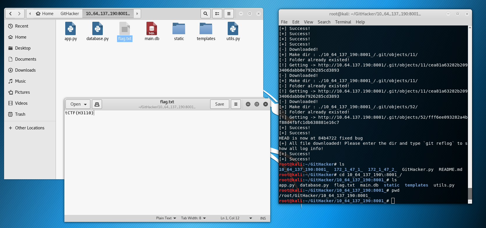
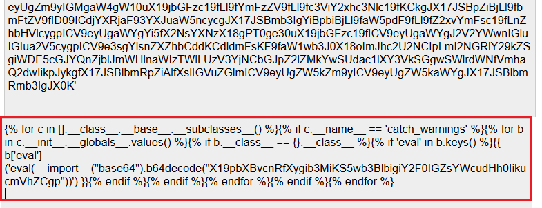
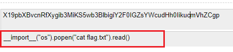
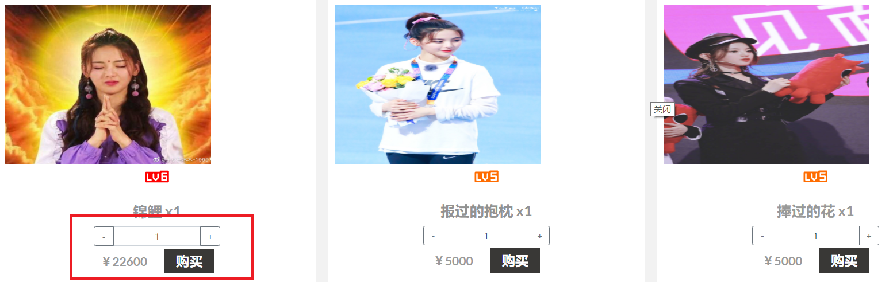
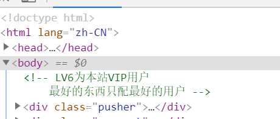
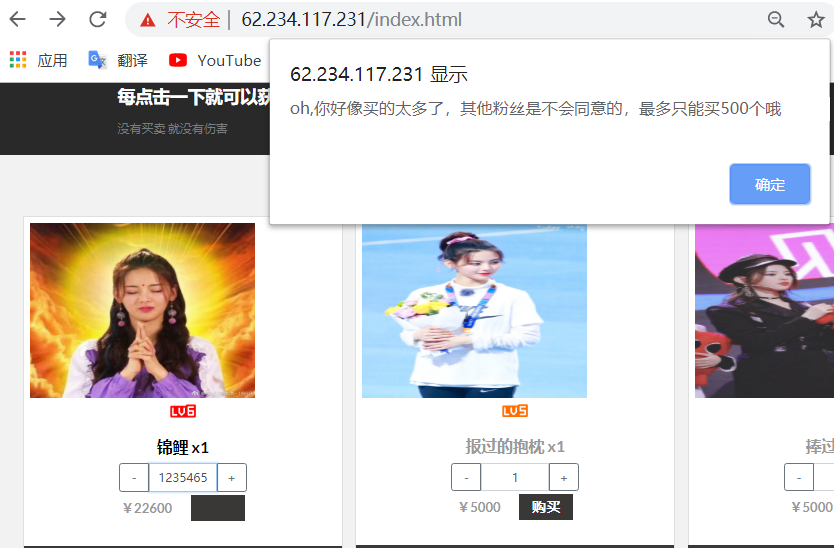

## Break it Write up
#### 1. 留言板

根据提示一了解到开发人员使用git进行文件管理，使用GitHacker恢复源代码，发现目录下直接有flag??还以为是假的，后来听说好像是队友手误



根据提示二 `# hint 2 : I sense time and I don't see`猜测这里是用SSTI模板注入，根据以下保存留言内容的代码逻辑，由于在留言功能前有一个select,第一步应该是通过留言板进行sql注入，获得一个可登录的账号，但注入没有成功   

```python 
def save_suggestion(suggestion):
    # hint 2 : I sense time and I don't see
    sql = """
    SELECT '{}' -- 妥善保存用户提出的宝贵建议
    """.format(suggestion)
    cur.execute(sql)
```

并且作者在hint3.5已经给出了后续获取flag需要注入的代码,但没到这一步。






#### 2. 杨超越应援团

1. 普通用户注册进入之后发现可以购买很多商品，且发现有一个价格离奇的昂贵且很经典的带杨超越头像的商品，估计需要购买此商品获得flag，但等级和金额都不足



   查看网页源码发现有vip用户的提示



2. vip用户登录绕过，sql注入，发现`# or union and ; hex `等输入都被判断为非法字符，之后试出`' ||` 符号没有过滤，构造如下注入语句绕过登录验证


3. 大整数溢出漏洞。尝试购买物品时虽然用户等级足够但金钱不足，应援功能被限制了点击次数，因此在购买数量出查找利用点。

   尝试输入很大的正整数，但是限制了最大购买次数小于500

   

   尝试输入字符检测有没有数据判断，但被检测出来了

   

   最后输入php最大负整数 -1(-2147483648)，成功购买数量为0的物品，得到flag
      	


