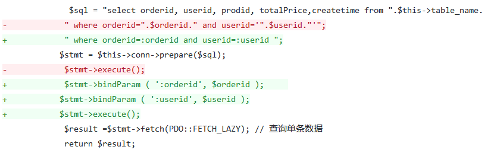
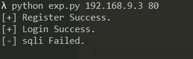
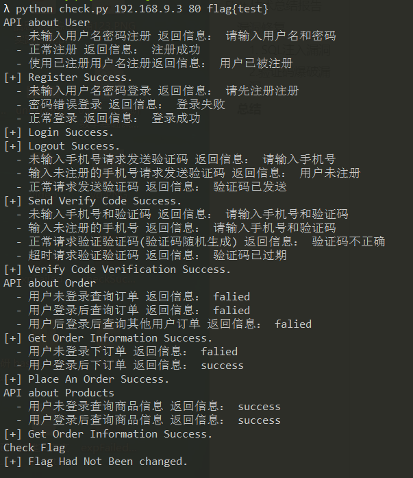
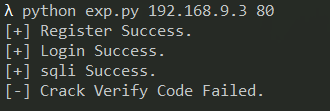
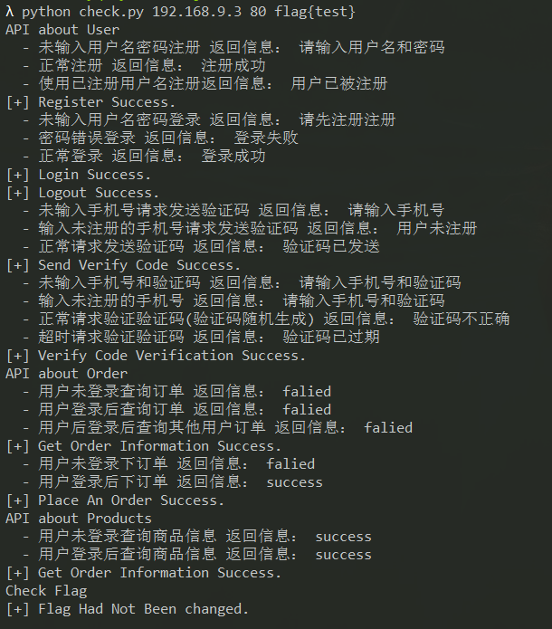

# FixIt 技术总结报告

## 漏洞修复

漏洞修复代码已在github仓库的以下两个分支中提交 

- fix_verify_code_crack
- fix_SQLi

### 1. SQL注入漏洞

- 漏洞类型：SQL注入

- 描述：在用户登录自己的账号进入商城，在查询订单功能处存在SQL注入，可获取数据库的敏感信息。

- 修复方式：将原来的直接拼接用户生成的SQL注入语句 改为 使用PDO预编译的执行sql语句。

  ​	如下图所示，使用预编译方式书写的SQL语句后，在php执行时，会先将SQL语句的模板和变量分开发送到MySQL,由MySQL完成变量的转义处理。

- 修复效果：

  - exp失败

  
  
  - check正常

  

### 2.验证码爆破漏洞 

- 漏洞类型：设计缺陷/逻辑错误

- 描述：在用户尝试使用手机号验证码登录时，验证码有1分钟的有效期。由于验证码是4位数字的验证码，因此及容易爆破，从而登录其他用户的账号。

- 修复方式：用户输入第一次输入验证码如果输入错误，验证码就设置为过期。只能尝试重新发送验证码进行登录。

- 修复效果：

  - exp失败

  
  
  - check正常

  
  

## 参考

[[PDO防注入原理分析以及使用PDO的注意事项](https://zhangxugg-163-com.iteye.com/blog/1835721)](<https://zhangxugg-163-com.iteye.com/blog/1835721>)